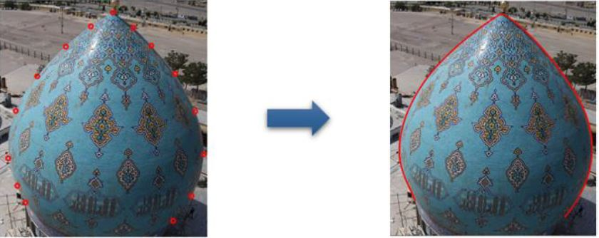

# Dome-3D-Reconstruction
A Graphical User Interface (GUI) is employed to facilitate running the program. You can choose your image and the desired algorithm
 to reconstruct the 3D model of a dome from a single image.

## GUI

Run the GUI in Matlab command window.

```bash
GUI
```


## Performance

### Input

Specify the path to your image (you can use example images in images folder) and the method of reconstruction.


Then locate some points (10-15 points is enough) on the borders of the dome and press Enter. 




### Output


and finally:


### Experiment
We tested our program on some other domes.


## References
<a id="1">[1]</a> 
W. Y. &. S. M. Jia, "3D Localization of Circular Feature in 2D Image and Application to Food Volume Estimation.," IEEE EMBS, 2012.

<a id="2">[2]</a> 
A. Z. Richard Hartley, "Multiple View Geometry in computer vision.," Cambridge University Press, 2003

<a id="3">[3]</a>
D. R. a. G. Sapiro, "Seeing 3D Objects in a Single 2D Image," IEEE 12th Int. Conf. Comput. Vis., pp. 1819-1826, 2009.

